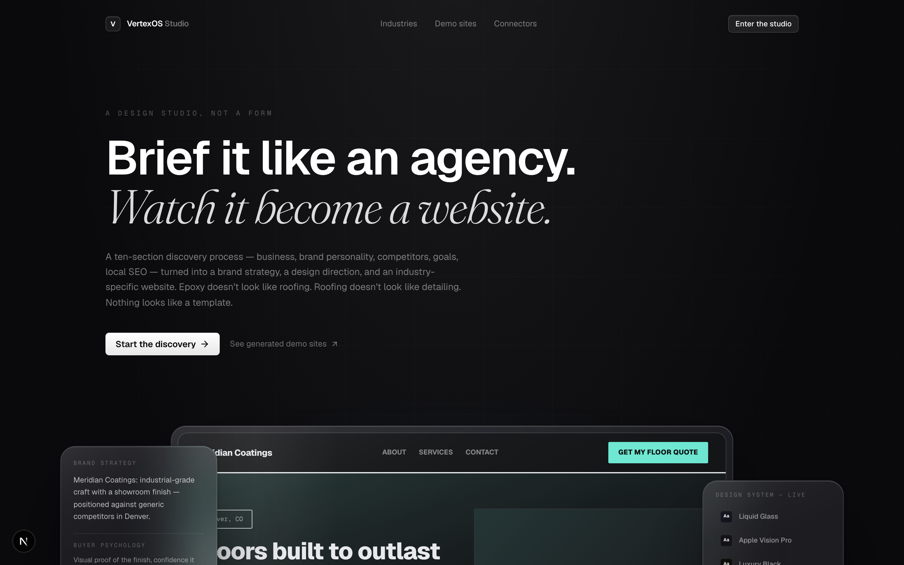
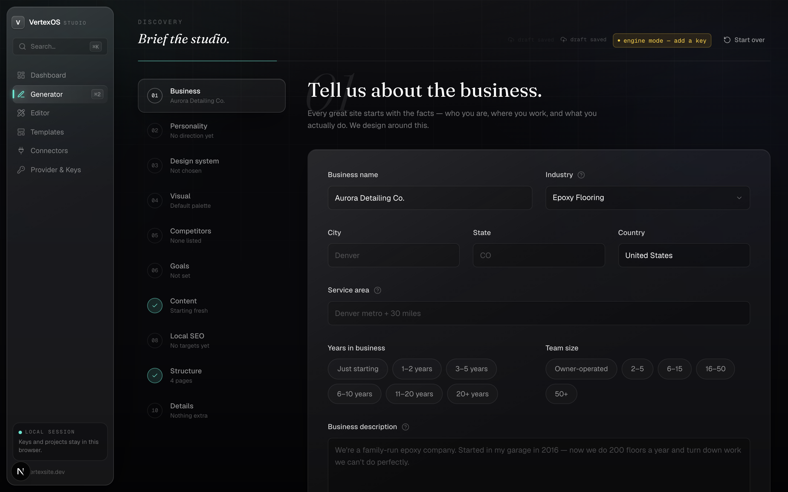
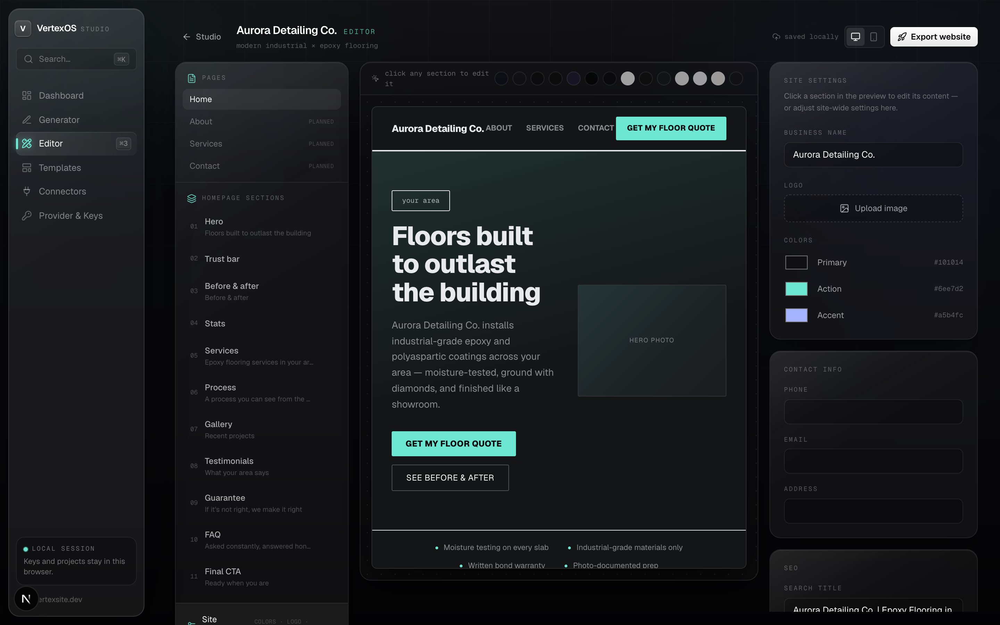
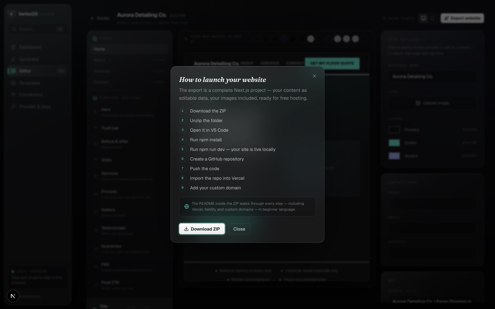

<div align="center">



# VertexOS

**Local-first AI website generation. Own the code. Host anywhere.**

An open-source AI workspace for generating, editing, and exporting websites — powered by *your* AI provider, running entirely in *your* browser.

<!-- Badges — replace placeholders once CI / npm / release are wired up -->


[Quick Start](#installation) · [Features](#features) · [Providers](#supported-providers) · [Usage](#usage) · [Roadmap](docs/ROADMAP.md) · [Contributing](docs/CONTRIBUTING.md) · [Deploy](docs/DEPLOYMENT.md)

</div>

---

## What is VertexOS?

VertexOS is a **free, open-source, local-first** workspace for building websites with AI.

You describe a business, choose a design direction, and VertexOS generates a complete, industry-aware website. From there you can preview it, edit it section by section, and **export the full source code** as a deployable Next.js project.

The important part: it runs on **your** AI provider and **your** API key, and everything — your brief, your keys, your projects — stays in your browser. There's no account, no cloud database, and nothing to sign up for. It even works with **no key at all** through a built-in strategy engine.

> **Beta.** VertexOS is in active development. AI output is a strong starting point, not a finished product — you're meant to edit, refine, and own it.

---

## Why VertexOS?

- **No platform lock-in.** Export your project and host it wherever you want. Leave anytime.
- **No forced subscription.** The tool is free. If you use a paid model, you pay your provider directly — never us.
- **No required account.** Open it and start. No email, no login, no onboarding wall.
- **No hidden ownership tricks.** What you generate is yours. Full stop ([read the promise](#ownership-promise)).
- **Bring your own models.** Plug in NVIDIA NIM, OpenRouter, DeepInfra, Gemini, a local Ollama model, or any OpenAI-compatible endpoint.
- **Export everything.** A real Next.js project — `package.json`, components, content, README — not a locked preview.

VertexOS is a **tool, not a platform**. It helps you build; the result belongs to you.

---

## Features

- 🧠 **AI website generation** — an agency-style discovery brief becomes a *design brief*, then an industry-specific website. The site is never generated directly from raw input:

  ```
  User input → Design Brief → Design DNA → Website Blueprint → Component System → Final Website
  ```

- 🎨 **Design style control** — choose the visual direction up front and watch the page re-architect itself to match.
- 🪟 **15 premium design systems** — Liquid Glass, Apple Vision Pro, Linear, Raycast, Arc, Vercel, Framer, Notion, Luxury Black, Minimal Editorial, Startup Modern, Premium Local, High-End Agency, Contractor Pro, Modern Industrial — each with its own layout, hero, navigation, motion, and typography rules.
- 🏗️ **Industry engine** — trade-specific homepage architecture, buyer psychology, and trust logic. Epoxy ≠ HVAC ≠ Roofing ≠ Auto Detailing.
- 🗂️ **Local project workflow** — projects auto-save to your browser and appear in the studio dashboard.
- ✍️ **Prompt-driven generation** — describe the business in plain language; the engine handles structure, copy, and layout.
- 🔌 **Agent-ready architecture** — MCP connectors (Supabase, GitHub, Maps, Stripe, …) in the same config shape used by Claude Desktop and Cursor.
- 🔑 **Provider-agnostic setup** — any OpenAI-compatible API works; switch providers without touching code.
- 📦 **Export full source code** — one click produces a complete, runnable Next.js + Tailwind project.
- 🧩 **Demo templates** — industry presets that pre-fill the brief so you can start fast.
- 💾 **Local storage support** — keys, drafts, and projects persist locally between sessions; images live in IndexedDB.
- 🛟 **Works with no key (engine mode)** — a deterministic Design DNA engine produces a real site fully offline; add a key for model-written copy.

---

## Ownership Promise

### You own what you generate.

VertexOS does **not** claim ownership over your generated websites, your content, or your exported source code.

- Your generated website **belongs to you.**
- Your content **belongs to you.**
- Your exported code **belongs to you.**

There are no usage rights we keep, no attribution we require, and no platform you're tied to. Generate it, edit it, export it, deploy it, sell it, or walk away — it's yours.

---

## Supported Providers

VertexOS talks to any **OpenAI-compatible** chat completions endpoint. Configure your provider in the in-app **Provider & Keys** settings — no code changes required.

| Provider | Notes |
| --- | --- |
| **NVIDIA NIM** | GPU-accelerated inference from build.nvidia.com |
| **OpenRouter** | One key, every model (incl. Claude & GPT families) |
| **DeepInfra** | Low-cost open-model hosting |
| **Google Gemini** | Gemini API with a free tier |
| **Claude-compatible / OpenAI-compatible APIs** | Any endpoint speaking the OpenAI chat format — including Anthropic via OpenRouter or a compatible proxy |
| **Ollama (local)** | Fully local, fully private — no key, runs on your machine |
| **Custom endpoint** | Point it at any base URL + model you like |

> Local model support runs today through **Ollama**. Deeper offline/local-model integration is on the [roadmap](docs/ROADMAP.md).

---

## Installation

**Requirements:** Node.js **18.18+** (Node 20+ recommended) and npm.

```bash
# 1. Clone
git clone https://github.com/your-org/VertexOS.git
cd VertexOS

# 2. Install dependencies
npm install

# 3. (Optional) copy the example env — see the note below
cp .env.example .env.local

# 4. Start the dev server
npm run dev
```

Open **http://localhost:3000** and you're in the studio. No account, no setup wizard.

Production build:

```bash
npm run build && npm start
```

---

## Environment Variables

**VertexOS needs no environment variables to run.** It is local-first by design: you add your AI provider and API key **inside the app** (the **Provider & Keys** page), and they're stored only in your browser — never written to disk, never sent to a server we control.

The included `.env.example` is **optional** and meant for self-hosters who want to document or pre-seed defaults in their own fork. The base app does not read these values at runtime.

```bash
# .env.example — OPTIONAL. The default app configures providers in the UI.
# These are placeholders for self-hosted forks that wire their own defaults.

AI_PROVIDER=        # openrouter | nvidia-nim | deepinfra | gemini | ollama | custom
AI_BASE_URL=        # OpenAI-compatible base URL (only for custom / ollama)
AI_API_KEY=         # your provider key — DO NOT commit a real key
AI_MODEL=           # e.g. anthropic/claude-3.5-sonnet
```

> 🔒 **Never commit real API keys.** `.env.local` is gitignored. In normal use you won't put a key in a file at all — you'll paste it into the app.

---

## Usage

1. **Choose a provider** — open **Provider & Keys** and pick NVIDIA NIM, OpenRouter, DeepInfra, Gemini, Ollama, or a custom endpoint.
2. **Add your API key** — paste it in (stored locally in your browser). *Or skip this and use engine mode.*
3. **Describe the business** — fill in the 10-section discovery brief: who you are, where you work, what you do.
4. **Choose a design direction** — Liquid Glass, Vision Pro, Luxury Black, Minimal Editorial, and others.
5. **Generate the website** — Phase 1 writes the design brief, Phase 2 builds the site from it. You land in Studio Mode.
6. **Edit sections** — click any section in the live preview and refine copy, CTAs, images, and visibility.
7. **Export the project** — download a complete Next.js project and deploy it anywhere.

See the [Deployment Guide](docs/DEPLOYMENT.md) for hosting on Vercel, Netlify, or your own server.

---

## Export Workflow

Export produces a complete, standalone Next.js project:

```
my-website.zip
├── package.json            # next + react + tailwind, nothing else
├── data/site.json          # ALL your content — edit text without touching code
├── components/site.tsx     # your design system, inlined and readable
├── public/images/          # your uploaded images
├── app/                    # layout, page, globals
├── tailwind.config.ts
└── README.md               # run locally → GitHub → Vercel / Netlify → custom domain
```

Run it with `npm install && npm run dev`. The bundled README walks a first-time user all the way to a live custom domain in plain language.

---

## Screenshots

| Studio | Generator |
| --- | --- |
|  |  |

| Editor | Export |
| --- | --- |
|  |  |

---

## Roadmap

A few of the things we're working toward (full list in [docs/ROADMAP.md](docs/ROADMAP.md)):

- A more powerful visual editor
- More templates and industries
- More AI providers out of the box
- Docker support
- One-click export
- A GitHub deployment guide
- Plugin / MCP ecosystem
- Offline / local-model support

---

## Contributing

Contributions are genuinely welcome — this project is built in public.

Issues, pull requests, new **templates**, **design systems**, **industry profiles**, and **provider integrations** are all great ways to help. You don't need to be an expert; small fixes and docs improvements matter too.

Start with [docs/CONTRIBUTING.md](docs/CONTRIBUTING.md).

---

## License

[MIT](LICENSE) © VertexOS contributors.

Use it, fork it, ship it. If you build something with VertexOS, we'd love to see it.
